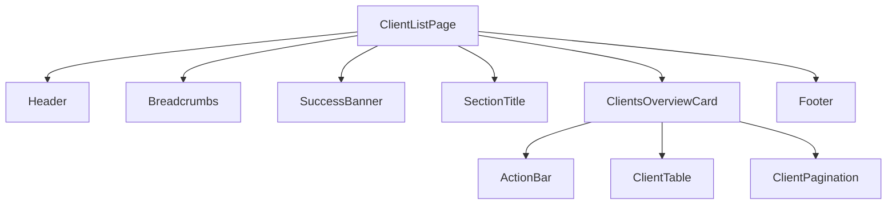

# Design Document: Client List Page

## Overview

The Client List Page provides users with a comprehensive view of all clients in the CORE application. It features a data table with search, filtering, bulk actions, and pagination capabilities. The page follows the existing application patterns using React, TypeScript, and MUI v7 components.

## Architecture

The Client List Page follows the established component architecture in the CORE application:

```
ClientListPage (main page component)
├── Header (existing component)
├── Breadcrumbs (MUI component)
├── SuccessBanner (new component)
├── SectionTitle (page title with search)
├── ClientsOverviewCard (card container)
│   ├── ActionBar (bulk actions, buttons)
│   ├── ClientTable (data table)
│   └── Pagination (page navigation)
└── Footer (existing component)
```

### Component Hierarchy



## Components and Interfaces

### ClientListPage Component

The main page component that orchestrates all child components and manages page-level state.

```typescript
interface ClientListPageProps {
  /** Initial success message to display (e.g., after adding a client) */
  successMessage?: string;
  /** Callback when navigating to add client page */
  onAddClient?: () => void;
}

interface ClientListPageState {
  clients: Client[];
  totalClients: number;
  currentPage: number;
  pageSize: number;
  searchQuery: string;
  selectedClientIds: string[];
  showSuccessBanner: boolean;
  successMessage: string;
  isLoading: boolean;
}
```

### SuccessBanner Component

A dismissable alert banner for displaying success messages.

```typescript
interface SuccessBannerProps {
  /** The message to display */
  message: string;
  /** Whether the banner is visible */
  visible: boolean;
  /** Callback when dismiss button is clicked */
  onDismiss: () => void;
}
```

### ActionBar Component

Contains bulk actions dropdown and action buttons.

```typescript
interface ActionBarProps {
  /** Total number of clients */
  totalClients: number;
  /** Number of selected clients */
  selectedCount: number;
  /** Callback when Add Client button is clicked */
  onAddClient: () => void;
  /** Callback when Show Details button is clicked */
  onShowDetails: () => void;
  /** Callback when Filters button is clicked */
  onFiltersClick: () => void;
  /** Callback when bulk action is applied */
  onBulkAction: (action: BulkAction) => void;
}

type BulkAction = 'delete' | 'export' | 'archive';
```

### ClientTable Component

The data table displaying client records.

```typescript
interface ClientTableProps {
  /** Array of client data to display */
  clients: Client[];
  /** Currently selected client IDs */
  selectedIds: string[];
  /** Callback when selection changes */
  onSelectionChange: (selectedIds: string[]) => void;
  /** Callback when client name is clicked */
  onClientClick: (clientId: string) => void;
  /** Callback when delete action is clicked */
  onDeleteClient: (clientId: string) => void;
  /** Whether data is loading */
  isLoading?: boolean;
}
```

### ClientPagination Component

Pagination controls for navigating through client pages.

```typescript
interface ClientPaginationProps {
  /** Current page number (1-indexed) */
  currentPage: number;
  /** Total number of pages */
  totalPages: number;
  /** Callback when page changes */
  onPageChange: (page: number) => void;
}
```

## Data Models

### Client Interface

```typescript
interface Client {
  /** Unique identifier for the client */
  id: string;
  /** Display name of the client */
  clientName: string;
  /** Client ID number */
  clientId: string;
  /** Current status of the client */
  status: ClientStatus;
  /** Reference ID for the client */
  clientReferenceId: string;
  /** Effective date of the client contract */
  effectiveDate: string;
  /** Number of operational units */
  operationalUnitsCount: number;
}

type ClientStatus = 'Complete' | 'Draft' | 'Pending' | 'Inactive';
```

### Pagination State

```typescript
interface PaginationState {
  currentPage: number;
  pageSize: number;
  totalItems: number;
  totalPages: number;
}
```

### Search and Filter State

```typescript
interface FilterState {
  searchQuery: string;
  statusFilter?: ClientStatus[];
  dateRange?: {
    start: string;
    end: string;
  };
}
```

## Styling Specifications

Based on the Figma design, the following styling tokens are used:

### Colors
| Token | Value | Usage |
|-------|-------|-------|
| Primary Blue | #002677 | Page title, active pagination, primary buttons |
| Link Blue | #0C55B8 | Client name links, pagination numbers |
| Success Green | #007000 | Complete status chip, success banner |
| Success Tint | #EFF6EF | Success banner background |
| Neutral White | #FFFFFF | Card background, table rows |
| Neutral Gray | #4B4D4F | Body text, secondary text |
| Background | #FAFCFF | Page background |
| Border | #CBCCCD | Card borders, table borders |
| Row Alternate | #FAFAFA | Alternating table row background |

### Typography
| Element | Font | Size | Weight |
|---------|------|------|--------|
| Page Title | Enterprise Sans VF | 26px | 700 |
| Card Title | Enterprise Sans VF | 20px | 700 |
| Table Header | Enterprise Sans VF | 14px | 700 |
| Table Body | Enterprise Sans VF | 16px | 400 |
| Button | Enterprise Sans VF | 16px | 700 |
| Client Count | Optum Sans | 14px | 700 |

### Spacing and Dimensions
| Element | Value |
|---------|-------|
| Page horizontal padding | 84px |
| Card border radius | 12px |
| Button border radius | 46px |
| Chip border radius | 4px |
| Table row padding | 32px 16px |
| Action bar gap | 12px |


## Correctness Properties

*A property is a characteristic or behavior that should hold true across all valid executions of a system—essentially, a formal statement about what the system should do. Properties serve as the bridge between human-readable specifications and machine-verifiable correctness guarantees.*

### Property 1: Search Filtering Correctness

*For any* search query string and any list of clients, when the search filter is applied, all clients in the filtered result should contain the search query (case-insensitive) in either their client name, client ID, or client reference ID.

**Validates: Requirements 2.2**

### Property 2: Status Chip Color Mapping

*For any* client with a status value, the rendered Status_Chip should display the correct color: green (#007000) for "Complete" status and gray (#4B4D4F) for "Draft" status.

**Validates: Requirements 3.5**

### Property 3: Bulk Action Application

*For any* set of selected client IDs and any bulk action, when the action is applied, the action callback should be invoked with exactly the set of selected client IDs.

**Validates: Requirements 4.4**

### Property 4: Client Count Accuracy

*For any* list of clients, the displayed "Number of clients" value should exactly match the total count of clients in the data source.

**Validates: Requirements 5.5**

### Property 5: Pagination Display Correctness

*For any* pagination state with total pages greater than 7, the pagination component should display ellipsis (...) to indicate hidden pages, and the last page number should always be visible for quick navigation.

**Validates: Requirements 6.4, 6.5**

### Property 6: Page Navigation Correctness

*For any* page number click within valid bounds (1 to totalPages), the client table should update to display exactly the clients corresponding to that page based on the page size.

**Validates: Requirements 6.6**

## Error Handling

### Network Errors
- Display a user-friendly error message when client data fails to load
- Provide a "Retry" button to attempt reloading the data
- Maintain any existing data in the table while showing the error

### Empty States
- Display a "No clients found" message when the client list is empty
- Display a "No results match your search" message when search returns no results
- Provide a "Clear search" action to reset the search filter

### Validation Errors
- Disable bulk action "Apply" button when no clients are selected
- Show tooltip explaining why the button is disabled

### Loading States
- Display skeleton loaders in the table while data is loading
- Disable pagination controls during loading
- Show loading indicator on search input during search operations

## Testing Strategy

### Unit Tests

Unit tests will verify specific examples and edge cases:

1. **Component Rendering Tests**
   - Verify Header, Footer, Breadcrumbs render correctly
   - Verify page title displays "Clients"
   - Verify search input has correct placeholder
   - Verify all table columns are present
   - Verify action buttons render with correct labels and icons

2. **Interaction Tests**
   - Verify Add Client button triggers navigation callback
   - Verify dismiss button hides success banner
   - Verify checkbox selection updates selected state
   - Verify page number click triggers page change callback

3. **Edge Case Tests**
   - Empty client list displays appropriate message
   - Single page pagination hides navigation controls
   - Very long client names are truncated appropriately

### Property-Based Tests

Property-based tests will use **fast-check** library for TypeScript to verify universal properties across many generated inputs. Each test will run a minimum of 100 iterations.

1. **Search Filter Property Test**
   - Generate random client lists and search queries
   - Verify all filtered results contain the search term
   - **Feature: client-list-page, Property 1: Search Filtering Correctness**

2. **Status Chip Color Property Test**
   - Generate random clients with various statuses
   - Verify correct color mapping for each status
   - **Feature: client-list-page, Property 2: Status Chip Color Mapping**

3. **Bulk Action Property Test**
   - Generate random client selections and actions
   - Verify action is applied to exactly the selected clients
   - **Feature: client-list-page, Property 3: Bulk Action Application**

4. **Client Count Property Test**
   - Generate random client lists of various sizes
   - Verify displayed count matches actual count
   - **Feature: client-list-page, Property 4: Client Count Accuracy**

5. **Pagination Display Property Test**
   - Generate random pagination states
   - Verify ellipsis and last page visibility rules
   - **Feature: client-list-page, Property 5: Pagination Display Correctness**

6. **Page Navigation Property Test**
   - Generate random page clicks and client data
   - Verify correct page of results is displayed
   - **Feature: client-list-page, Property 6: Page Navigation Correctness**

### Test Configuration

```typescript
// vitest.config.ts additions for property-based testing
import { fc } from 'fast-check';

// Configure fast-check for minimum 100 iterations
fc.configureGlobal({ numRuns: 100 });
```

### Test File Structure

```
src/
├── components/
│   ├── ClientListPage.tsx
│   ├── ClientListPage.test.tsx        # Unit tests
│   ├── ClientListPage.property.test.tsx # Property-based tests
│   ├── ClientTable.tsx
│   ├── ClientTable.test.tsx
│   ├── ClientPagination.tsx
│   ├── ClientPagination.test.tsx
│   ├── SuccessBanner.tsx
│   ├── SuccessBanner.test.tsx
│   └── ActionBar.tsx
```
