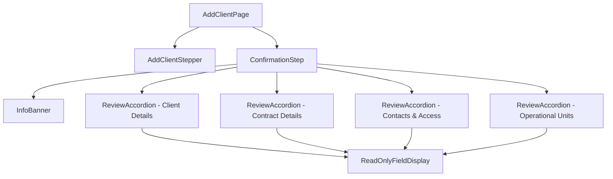

# Design Document: Confirmation Step

## Overview

The Confirmation Step is the fifth and final step in the Add Client multi-step form workflow. It provides a comprehensive read-only review of all data entered across the previous four steps before final submission. The component uses collapsible accordion sections to organize data by category, with edit icons enabling navigation back to specific steps for modifications.

## Architecture

The Confirmation Step follows the existing step component pattern established by `ClientDetailsStep`, `ContractDetailsStep`, `ContactsAccessStep`, and `OperationalUnitsStep`. It integrates with the parent `AddClientPage` component which manages form state via react-hook-form.



## Components and Interfaces

### ConfirmationStep Component

```typescript
interface ConfirmationStepProps {
  formData: AddClientCombinedFormData;
  onEditStep: (stepIndex: number) => void;
  onConfirm: () => void;
  onSaveDraft: () => void;
  onGoBack: () => void;
}
```

The main component that orchestrates the confirmation view. It receives the complete form data and callbacks for navigation and submission actions.

### ReviewAccordion Component

```typescript
interface ReviewAccordionProps {
  title: string;
  subtitle: string;
  defaultExpanded?: boolean;
  onEdit: () => void;
  children: React.ReactNode;
}
```

A reusable accordion component for displaying review sections. Features:
- Expandable/collapsible content area
- Edit icon in header for navigation
- Chevron indicator for expand/collapse state
- Consistent styling per design system

### InfoBanner Component

```typescript
interface InfoBannerProps {
  title: string;
  message: string;
}
```

A notification banner component that displays informational messages. Uses MUI Alert component with custom styling to match the Figma design.

### ReadOnlyField Component

```typescript
interface ReadOnlyFieldProps {
  label: string;
  value: string | undefined;
  placeholder?: string;
}
```

A simple component for displaying label-value pairs in read-only format.

## Data Models

The Confirmation Step uses the existing `AddClientCombinedFormData` type from the schema:

```typescript
// From src/schemas/addClientSchema.ts
type AddClientCombinedFormData = {
  // Step 1: Client Details
  clientReferenceId: string;
  clientId?: string;
  clientName: string;
  clientStatus?: string;
  source: string;
  addresses: ClientDetailsAddressData[];

  // Step 2: Contract Details
  effectiveDate: string;
  contractSource: string;
  invoiceBreakout: string;
  claimInvoiceFrequency: string;
  feeInvoiceFrequency: string;
  invoiceAggregationLevel: string;
  invoiceType: string;
  deliveryOption: string;
  supportDocumentVersion: string;
  // ... additional contract fields

  // Step 3: Contacts & Access
  contacts: Contact[];

  // Step 4: Operational Units
  operationalUnits: OperationalUnitData[];
};
```

## Correctness Properties

*A property is a characteristic or behavior that should hold true across all valid executions of a system-essentially, a formal statement about what the system should do. Properties serve as the bridge between human-readable specifications and machine-verifiable correctness guarantees.*

### Property 1: Form Data Display Completeness

*For any* valid `AddClientCombinedFormData` object, when the ConfirmationStep component is rendered with that data, all non-empty field values from Client Details, Contract Details, Contacts, and Operational Units SHALL be present in the rendered output.

**Validates: Requirements 3.4, 4.4, 5.4, 6.4**

### Property 2: Operational Units Accordion Count

*For any* valid `AddClientCombinedFormData` with N operational units (where N >= 1), the ConfirmationStep SHALL render exactly N Operational Units accordion sections.

**Validates: Requirements 6.1**

### Property 3: Operational Unit Name Display

*For any* operational unit in the form data, the corresponding accordion header SHALL contain the operational unit's name in the format "Operational Units - [name]".

**Validates: Requirements 6.2**

### Property 4: Empty Field Placeholder Display

*For any* optional field in the form data that has an empty or undefined value, the ConfirmationStep SHALL display an appropriate placeholder or dash character instead of blank space.

**Validates: Requirements 9.4**

### Property 5: Read-Only Field Rendering

*For any* field displayed in the ConfirmationStep, the field SHALL be rendered as non-editable text (not as an input element).

**Validates: Requirements 9.1**

## Error Handling

### Missing Form Data
- If `formData` prop is undefined or null, the component should display an error state or redirect to step 1
- Individual missing fields should display placeholder text (e.g., "-" or "Not provided")

### Navigation Errors
- If `onEditStep` callback fails, display an error toast notification
- Maintain current step state on navigation failure

### Submission Errors
- If `onConfirm` callback fails, display an error message and keep the user on the confirmation step
- Allow retry of submission

## Testing Strategy

### Unit Tests
Unit tests will verify specific examples and edge cases:

1. **Component Rendering**
   - Verify InfoBanner renders with correct title and message
   - Verify all four accordion sections render (Client Details, Contract Details, Contacts & Access, Operational Units)
   - Verify action buttons render with correct labels

2. **User Interactions**
   - Verify clicking edit icon calls `onEditStep` with correct step index
   - Verify clicking Confirm button calls `onConfirm`
   - Verify clicking Save as Draft button calls `onSaveDraft`
   - Verify clicking Go Back button calls `onGoBack`
   - Verify accordion expand/collapse functionality

3. **Edge Cases**
   - Empty optional fields display placeholder
   - Multiple operational units render separate accordions
   - Single contact displays correctly
   - Multiple addresses display correctly

### Property-Based Tests
Property-based tests will use Vitest with fast-check library to verify universal properties:

1. **Property 1: Form Data Display Completeness**
   - Generate random valid form data
   - Render ConfirmationStep with generated data
   - Assert all non-empty values appear in rendered output
   - Minimum 100 iterations

2. **Property 2: Operational Units Accordion Count**
   - Generate form data with random number of operational units (1-10)
   - Render ConfirmationStep
   - Assert accordion count equals operational units array length
   - Minimum 100 iterations

3. **Property 3: Operational Unit Name Display**
   - Generate operational units with random names
   - Render ConfirmationStep
   - Assert each accordion header contains corresponding unit name
   - Minimum 100 iterations

4. **Property 4: Empty Field Placeholder Display**
   - Generate form data with some empty optional fields
   - Render ConfirmationStep
   - Assert empty fields show placeholder text
   - Minimum 100 iterations

5. **Property 5: Read-Only Field Rendering**
   - Generate random form data
   - Render ConfirmationStep
   - Assert no input elements are present in the rendered output
   - Minimum 100 iterations

### Test Configuration
- Testing framework: Vitest
- Property-based testing library: fast-check
- React testing: @testing-library/react
- Each property test tagged with: **Feature: confirmation-step, Property {number}: {property_text}**

