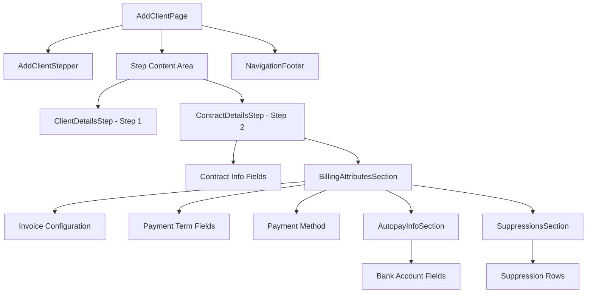

# Design Document: Contract Details Step

## Overview

The Contract Details Step is the second step in the Add Client multi-step wizard. It captures contract information, billing configuration, payment details, suppression settings, and optional autopay details. The component follows the existing accordion pattern established by ClientDetailsStep and integrates with the react-hook-form based form management system.

## Architecture



The Contract Details Step follows the same architectural pattern as the existing Client Details Step:
- Accordion-based collapsible section
- react-hook-form for form state management
- Zod schema for validation
- MUI Grid for responsive layout
- Dynamic field arrays for suppressions

## Components and Interfaces

### ContractDetailsStep Component

```typescript
interface ContractDetailsStepProps {
  control: Control<AddClientCombinedFormData>;
  errors: FieldErrors<AddClientCombinedFormData>;
  watch: UseFormWatch<AddClientCombinedFormData>;
}

export const ContractDetailsStep: React.FC<ContractDetailsStepProps> = ({
  control,
  errors,
  watch,
}) => {
  // Component implementation
};
```

### SuppressionRow Component (New)

A component for managing individual suppression entries:

```typescript
interface SuppressionRowProps {
  index: number;
  control: Control<AddClientCombinedFormData>;
  errors: FieldErrors<AddClientCombinedFormData>;
  onRemove: () => void;
  showDelete: boolean;
}

export const SuppressionRow: React.FC<SuppressionRowProps> = ({
  index,
  control,
  errors,
  onRemove,
  showDelete,
}) => {
  // Renders suppression type dropdown, start date, end date, and delete button
};
```

### NavigationFooter Component

Footer with Next and Go Back buttons:

```typescript
interface NavigationFooterProps {
  onNext: () => void;
  onBack: () => void;
  nextLabel?: string;
  backLabel?: string;
}
```

## Data Models

### Contract Details Step Schema

```typescript
// Suppression entry schema
const suppressionEntrySchema = z.object({
  suppressionType: z.string().optional(),
  suppressionStartDate: z.string().optional(),
  suppressionEndDate: z.string().optional(),
});

// Contract Details Step Schema
export const contractDetailsStepSchema = z.object({
  // Contract Information
  clientContractId: z.string().optional(),
  effectiveDate: z.string().min(1, 'Required field'),
  terminationDate: z.string().optional(),
  contractTerm: z.string().optional(),
  clientMembership: z.string().optional(),
  clientDoaSignor: z.string().optional(),
  contractingLegalEntityOptumRx: z.string().optional(),
  contractingLegalEntityClient: z.string().optional(),
  assignedTo: z.string().optional(),
  runOffEffectiveDate: z.string().optional(),
  contractSource: z.string().min(1, 'Required field'),

  // Billing Attributes
  invoiceBreakout: z.string().min(1, 'Required field'),
  claimInvoiceFrequency: z.string().min(1, 'Required field'),
  feeInvoiceFrequency: z.string().min(1, 'Required field'),
  invoiceAggregationLevel: z.string().min(1, 'Required field'),
  invoiceType: z.string().min(1, 'Required field'),
  invoicingClaimQuantityCounts: z.string().optional(),
  deliveryOption: z.string().min(1, 'Required field'),
  supportDocumentVersion: z.string().min(1, 'Required field'),
  invoiceStaticData: z.string().optional(),
  
  // Payment Terms
  feeInvoicePaymentTerm: z.string().optional(),
  feeInvoicePaymentTermDayType: z.string().optional(),
  claimInvoicePaymentTerm: z.string().optional(),
  claimInvoicePaymentTermDayType: z.string().optional(),
  
  // Payment Method
  paymentMethod: z.string().optional(),

  // Autopay Information (conditional)
  bankAccountType: z.string().optional(),
  routingNumber: z.string().optional(),
  accountNumber: z.string().optional(),
  accountHolderName: z.string().optional(),

  // Suppressions
  addSuppressions: z.enum(['yes', 'no']).default('no'),
  suppressions: z.array(suppressionEntrySchema).default([]),
});

export type ContractDetailsStepFormData = z.infer<typeof contractDetailsStepSchema>;
```

### Dropdown Options

```typescript
// Source options
const SOURCE_OPTIONS = [
  { value: 'direct', label: 'Direct' },
  { value: 'referral', label: 'Referral' },
  { value: 'partner', label: 'Partner' },
];

// Assigned To options
const ASSIGNED_TO_OPTIONS = [
  { value: 'user1', label: 'User 1' },
  { value: 'user2', label: 'User 2' },
  { value: 'user3', label: 'User 3' },
];

// Invoice Breakout options
const INVOICE_BREAKOUT_OPTIONS = [
  { value: 'client', label: 'Client' },
  { value: 'operational_unit', label: 'Operational Unit' },
  { value: 'both', label: 'Both' },
];

// Invoice Frequency options
const INVOICE_FREQUENCY_OPTIONS = [
  { value: 'weekly', label: 'Weekly' },
  { value: 'biweekly', label: 'Bi-Weekly' },
  { value: 'monthly', label: 'Monthly' },
  { value: 'quarterly', label: 'Quarterly' },
];

// Invoice Aggregation Level options
const INVOICE_AGGREGATION_OPTIONS = [
  { value: 'client', label: 'Client' },
  { value: 'operational_unit', label: 'Operational Unit' },
  { value: 'contract', label: 'Contract' },
];

// Invoice Type options
const INVOICE_TYPE_OPTIONS = [
  { value: 'standard', label: 'Standard' },
  { value: 'detailed', label: 'Detailed' },
  { value: 'summary', label: 'Summary' },
];

// Delivery Option options
const DELIVERY_OPTIONS = [
  { value: 'email', label: 'Email' },
  { value: 'portal', label: 'Portal' },
  { value: 'mail', label: 'Mail' },
];

// Support Document Version options
const SUPPORT_DOC_VERSION_OPTIONS = [
  { value: 'v1', label: 'Version 1' },
  { value: 'v2', label: 'Version 2' },
  { value: 'v3', label: 'Version 3' },
];

// Payment Method options
const PAYMENT_METHOD_OPTIONS = [
  { value: 'ach', label: 'ACH' },
  { value: 'check', label: 'Check' },
  { value: 'wire', label: 'Wire Transfer' },
];

// Bank Account Type options
const BANK_ACCOUNT_TYPE_OPTIONS = [
  { value: 'checking', label: 'Checking' },
  { value: 'savings', label: 'Savings' },
];

// Claim Quantity Counts options
const CLAIM_QUANTITY_OPTIONS = [
  { value: 'scripts', label: 'Scripts' },
  { value: 'claims', label: 'Claims' },
  { value: 'both', label: 'Both' },
];

// Payment Term Days options
const PAYMENT_TERM_DAYS_OPTIONS = [
  { value: '15', label: '15' },
  { value: '30', label: '30' },
  { value: '45', label: '45' },
  { value: '60', label: '60' },
  { value: '90', label: '90' },
];

// Day Type options
const DAY_TYPE_OPTIONS = [
  { value: 'calendar', label: 'Calendar Days' },
  { value: 'business', label: 'Business Days' },
];

// Suppression Type options
const SUPPRESSION_TYPE_OPTIONS = [
  { value: 'rejected_claims', label: 'Rejected Claims' },
  { value: 'net_zero_claims', label: 'Net-Zero Claims' },
  { value: 'zero_dollar_claims', label: 'Zero Dollar Claims' },
];
```


## Component Layout

### Desktop Layout (3-column grid)

```
┌─────────────────────────────────────────────────────────────────────┐
│ Contract Details                                              [▼]   │
│ Complete the fields below.                                          │
├─────────────────────────────────────────────────────────────────────┤
│ ┌──────────────┐ ┌──────────────┐ ┌──────────────┐                  │
│ │ Contract ID  │ │ Effective    │ │ Termination  │                  │
│ │              │ │ Date*        │ │ Date         │                  │
│ └──────────────┘ └──────────────┘ └──────────────┘                  │
│ ┌──────────────┐ ┌──────────────┐ ┌──────────────┐                  │
│ │ Contract     │ │ Client       │ │ Client DOA   │                  │
│ │ Term         │ │ Membership   │ │ Signor       │                  │
│ └──────────────┘ └──────────────┘ └──────────────┘                  │
│ ┌──────────────┐ ┌──────────────┐ ┌──────────────┐                  │
│ │ Legal Entity │ │ Legal Entity │ │ Assigned To  │                  │
│ │ OptumRx      │ │ Client       │ │              │                  │
│ └──────────────┘ └──────────────┘ └──────────────┘                  │
│ ┌──────────────┐ ┌──────────────┐                                   │
│ │ Run-Off Date │ │ Source*      │                                   │
│ └──────────────┘ └──────────────┘                                   │
├─────────────────────────────────────────────────────────────────────┤
│ ┌─────────────────────────────────────────────────────────────────┐ │
│ │ Billing Attributes                                        [▼]  │ │
│ │ You may override the billing attributes...                     │ │
│ │ ┌──────────────┐ ┌──────────────┐ ┌──────────────┐              │ │
│ │ │ Invoice      │ │ Claim Inv    │ │ Fee Invoice  │              │ │
│ │ │ Breakout*    │ │ Frequency*   │ │ Frequency*   │              │ │
│ │ └──────────────┘ └──────────────┘ └──────────────┘              │ │
│ │ ┌──────────────┐ ┌──────────────┐ ┌──────────────┐              │ │
│ │ │ Aggregation* │ │ Invoice Type*│ │ Quantity     │              │ │
│ │ └──────────────┘ └──────────────┘ └──────────────┘              │ │
│ │ ┌──────────────┐ ┌──────────────┐ ┌──────────────┐              │ │
│ │ │ Delivery*    │ │ Doc Version* │ │ Static Data  │              │ │
│ │ └──────────────┘ └──────────────┘ └──────────────┘              │ │
│ │ ┌──────────────┐ ┌──────────────┐                               │ │
│ │ │ Fee Payment  │ │ Day Type     │                               │ │
│ │ │ Term         │ │              │                               │ │
│ │ └──────────────┘ └──────────────┘                               │ │
│ │ ┌──────────────┐ ┌──────────────┐                               │ │
│ │ │ Claim Payment│ │ Day Type     │                               │ │
│ │ │ Term         │ │              │                               │ │
│ │ └──────────────┘ └──────────────┘                               │ │
│ │ ┌──────────────┐                                                │ │
│ │ │ Payment      │                                                │ │
│ │ │ Method       │                                                │ │
│ │ └──────────────┘                                                │ │
│ │ ─────────────────────────────────────────────────────────────── │ │
│ │ (ACH Section - conditional)                                     │ │
│ │ ┌──────────────┐ ┌──────────────┐ ┌──────────────┐              │ │
│ │ │ Bank Account │ │ Routing      │ │ Account      │              │ │
│ │ │ Type*        │ │ Number*      │ │ Number*      │              │ │
│ │ └──────────────┘ └──────────────┘ └──────────────┘              │ │
│ │ ┌──────────────┐                                                │ │
│ │ │ Account      │                                                │ │
│ │ │ Holder Name* │                                                │ │
│ │ └──────────────┘                                                │ │
│ │ ─────────────────────────────────────────────────────────────── │ │
│ │ Add Suppressions  ○ Yes  ● No                                   │ │
│ │ (Suppression rows - conditional when Yes)                       │ │
│ │ ┌──────────────┐ ┌──────────────┐ ┌──────────────┐              │ │
│ │ │ Suppression  │ │ Start Date   │ │ End Date     │              │ │
│ │ │ Type         │ │              │ │              │              │ │
│ │ └──────────────┘ └──────────────┘ └──────────────┘              │ │
│ │ ─────────────────────────────────────────────────────────────── │ │
│ │ ┌──────────────┐ ┌──────────────┐ ┌──────────────┐  [🗑]        │ │
│ │ │ Suppression  │ │ Start Date   │ │ End Date     │              │ │
│ │ │ Type         │ │              │ │              │              │ │
│ │ └──────────────┘ └──────────────┘ └──────────────┘              │ │
│ │ [+ Add another suppression]                                     │ │
│ └─────────────────────────────────────────────────────────────────┘ │
└─────────────────────────────────────────────────────────────────────┘
┌─────────────────────────────────────────────────────────────────────┐
│                                          [Next]  [Go Back]          │
└─────────────────────────────────────────────────────────────────────┘
```

### Styling Specifications

| Element | Property | Value |
|---------|----------|-------|
| Accordion | Border | 1px solid #CBCCCD |
| Accordion | Border Radius | 12px |
| Accordion | Padding | 30px 24px |
| Section Title | Font | 20px, Bold, #000000 |
| Section Subtitle | Font | 16px, Regular, #4B4D4F |
| Field Label | Font | 16px, Bold, #323334 |
| Field Input | Font | 16px, Regular, #323334 |
| Grid Gap | Row/Column | 24px |
| Date Picker Button | Background | #002677 |
| Billing Section | Border | 1px solid #CBCCCD |
| Billing Section | Border Radius | 12px |
| Billing Section | Padding | 24px |
| Add Suppression Button | Color | #0C55B8 |
| Add Suppression Button | Font | 14px, Bold |
| Delete Icon | Size | 24px |
| Navigation Footer | Border Top | 1px solid #CBCCCD |
| Navigation Footer | Padding | 4px 84px |
| Next Button | Background | #002677 |
| Next Button | Border Radius | 46px |
| Next Button | Padding | 10px 24px |
| Go Back Button | Background | #FFFFFF |
| Go Back Button | Border | 1px solid #323334 |
| Go Back Button | Border Radius | 46px |


## Correctness Properties

*A property is a characteristic or behavior that should hold true across all valid executions of a system-essentially, a formal statement about what the system should do. Properties serve as the bridge between human-readable specifications and machine-verifiable correctness guarantees.*

### Property 1: Date Format Consistency

*For any* valid date value entered in a date field, the displayed format SHALL match the MM-DD-YYYY pattern.

**Validates: Requirements 2.13**

### Property 2: Autopay Section Conditional Visibility

*For any* payment method value, the Autopay Information Section SHALL be visible if and only if the payment method equals "ACH".

**Validates: Requirements 4.1, 4.2**

### Property 3: Suppressions Section Conditional Visibility

*For any* Add Suppressions radio value, the suppression configuration fields SHALL be visible if and only if the value equals "Yes".

**Validates: Requirements 5.2, 5.3**

### Property 4: Suppression Array Management

*For any* suppression array state:
- Adding a suppression SHALL increase the array length by 1
- Removing a suppression SHALL decrease the array length by 1
- Delete button SHALL be visible for all rows except the first (index > 0)

**Validates: Requirements 5.7, 5.8, 5.9**

### Property 5: Required Field Validation

*For any* required field in the Contract Details form, if the field value is empty or whitespace-only when validation is triggered, the form SHALL display "Required field" as the error message for that field.

**Validates: Requirements 6.1, 6.2, 6.3, 6.4**

### Property 6: Conditional Autopay Validation

*For any* form state where payment method is "ACH", all autopay fields (Bank Account Type, Routing Number, Account Number, Account Holder Name) SHALL be validated as required fields.

**Validates: Requirements 6.5**

### Property 7: Valid Form Enables Navigation

*For any* form state where all required fields contain valid non-empty values, the form SHALL allow navigation to the next step (validation passes).

**Validates: Requirements 6.6**

### Property 8: Form Data Persistence Round Trip

*For any* form data entered in the Contract Details step, navigating away from Step 2 and returning SHALL restore the exact same form data values.

**Validates: Requirements 8.2, 8.3**

### Property 9: Navigation Validation Trigger

*For any* form state when the "Next" button is clicked, the form SHALL trigger validation on all required fields before allowing navigation to Step 3.

**Validates: Requirements 9.5**

### Property 10: Back Navigation Data Preservation

*For any* form data entered in the Contract Details step, clicking "Go Back" SHALL navigate to Step 1 while preserving all entered form data.

**Validates: Requirements 9.6**

## Error Handling

### Validation Errors

| Error Condition | Error Message | Display Location |
|----------------|---------------|------------------|
| Required field empty | "Required field" | Below the field |
| Invalid date format | "Invalid date format" | Below the date field |
| Autopay fields empty when ACH selected | "Required field" | Below each empty autopay field |

### Error Display Pattern

Following the existing FormTextField pattern:
- Error icon displayed in the input field end adornment
- Error message displayed below the field in red (#C40000)
- Field border changes to red (#C40000) on error

### Form-Level Error Handling

- Form submission is blocked until all required fields are valid
- Scroll to first error field on validation failure
- Focus first error field for accessibility

## Testing Strategy

### Unit Tests

Unit tests will verify specific examples and edge cases:

1. **Component Rendering Tests**
   - Accordion renders with correct title and subtitle
   - All form fields render with correct labels
   - Date picker shows calendar icon
   - Radio buttons render with correct options
   - Suppression rows render correctly

2. **Conditional Rendering Tests**
   - Autopay section hidden when payment method is not ACH
   - Autopay section visible when payment method is ACH
   - Suppression fields hidden when Add Suppressions is "No"
   - Suppression fields visible when Add Suppressions is "Yes"

3. **Integration Tests**
   - Form integrates with parent Add Client form
   - Step navigation works correctly
   - Navigation buttons trigger correct actions

### Property-Based Tests

Property-based tests will validate universal properties using a PBT library (e.g., fast-check):

1. **Date Format Property Test**
   - Generate random valid dates
   - Verify display format matches MM-DD-YYYY
   - Minimum 100 iterations
   - **Feature: contract-details-step, Property 1: Date Format Consistency**

2. **Autopay Visibility Property Test**
   - Generate random payment method values
   - Verify autopay section visibility matches ACH condition
   - Minimum 100 iterations
   - **Feature: contract-details-step, Property 2: Autopay Section Conditional Visibility**

3. **Suppressions Visibility Property Test**
   - Generate random Add Suppressions values (yes/no)
   - Verify suppression fields visibility matches condition
   - Minimum 100 iterations
   - **Feature: contract-details-step, Property 3: Suppressions Section Conditional Visibility**

4. **Suppression Array Property Test**
   - Generate random add/remove operations
   - Verify array length changes correctly
   - Verify delete button visibility based on index
   - Minimum 100 iterations
   - **Feature: contract-details-step, Property 4: Suppression Array Management**

5. **Required Field Validation Property Test**
   - Generate random form states with empty required fields
   - Verify "Required field" error message appears
   - Minimum 100 iterations
   - **Feature: contract-details-step, Property 5: Required Field Validation**

6. **Form Data Persistence Property Test**
   - Generate random valid form data
   - Simulate navigation away and back
   - Verify data equality
   - Minimum 100 iterations
   - **Feature: contract-details-step, Property 8: Form Data Persistence Round Trip**

### Test Configuration

```typescript
// Property test configuration
const propertyTestConfig = {
  numRuns: 100,
  verbose: true,
};
```
