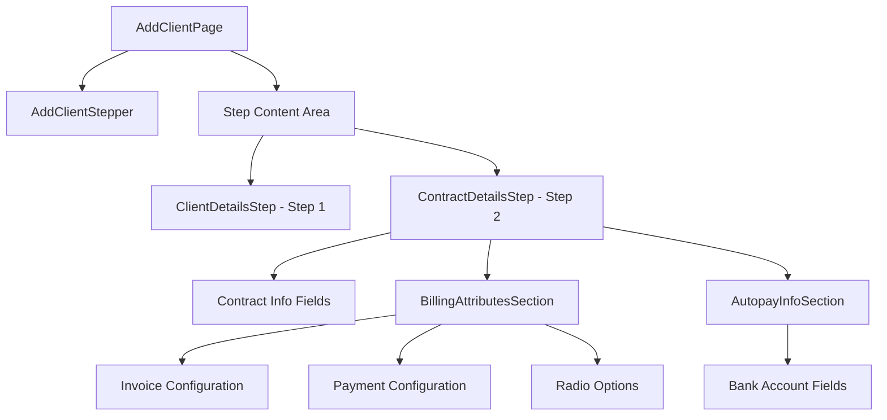

# Design Document: Contract Details Step

## Overview

The Contract Details Step is the second step in the Add Client multi-step wizard. It captures contract information, billing configuration, and optional autopay details. The component follows the existing accordion pattern established by ClientDetailsStep and integrates with the react-hook-form based form management system.

## Architecture



The Contract Details Step follows the same architectural pattern as the existing Client Details Step:
- Accordion-based collapsible section
- react-hook-form for form state management
- Zod schema for validation
- MUI Grid for responsive layout

## Components and Interfaces

### ContractDetailsStep Component

```typescript
interface ContractDetailsStepProps {
  control: Control<ContractDetailsStepFormData>;
  errors: FieldErrors<ContractDetailsStepFormData>;
  watch: UseFormWatch<ContractDetailsStepFormData>;
}

export const ContractDetailsStep: React.FC<ContractDetailsStepProps> = ({
  control,
  errors,
  watch,
}) => {
  // Component implementation
};
```

### FormDateField Component (New)

A new reusable date picker component following the existing FormTextField pattern:

```typescript
interface FormDateFieldProps<T extends FieldValues> {
  name: Path<T>;
  control: Control<T>;
  label: string;
  required?: boolean;
  placeholder?: string;
  error?: FieldError;
  disabled?: boolean;
}

export const FormDateField = <T extends FieldValues>({
  name,
  control,
  label,
  required,
  placeholder = 'MM-DD-YYYY',
  error,
  disabled,
}: FormDateFieldProps<T>) => {
  // Uses MUI DatePicker with calendar icon button
};
```

### FormRadioGroup Component (New)

A reusable radio button group component:

```typescript
interface FormRadioGroupProps<T extends FieldValues> {
  name: Path<T>;
  control: Control<T>;
  label: string;
  options: { value: string; label: string }[];
  row?: boolean;
}

export const FormRadioGroup = <T extends FieldValues>({
  name,
  control,
  label,
  options,
  row = true,
}: FormRadioGroupProps<T>) => {
  // Radio group implementation
};
```

### BillingAttributesSection Component

A nested section within Contract Details for billing configuration:

```typescript
interface BillingAttributesSectionProps {
  control: Control<ContractDetailsStepFormData>;
  errors: FieldErrors<ContractDetailsStepFormData>;
  paymentMethod: string;
}
```

## Data Models

### Contract Details Step Schema

```typescript
// Contract Details Step Schema
export const contractDetailsStepSchema = z.object({
  // Contract Information
  clientContractId: z.string().optional(),
  effectiveDate: z.string().min(1, 'Required field'),
  terminationDate: z.string().optional(),
  contractTerm: z.string().optional(),
  clientMembership: z.string().optional(),
  clientDoaSignor: z.string().optional(),
  contractingLegalEntityOptumRx: z.string().optional(),
  contractingLegalEntityClient: z.string().optional(),
  assignedTo: z.string().optional(),
  runOffEffectiveDate: z.string().optional(),
  source: z.string().min(1, 'Required field'),

  // Billing Attributes
  invoiceBreakout: z.string().min(1, 'Required field'),
  claimInvoiceFrequency: z.string().min(1, 'Required field'),
  feeInvoiceFrequency: z.string().min(1, 'Required field'),
  invoiceAggregationLevel: z.string().min(1, 'Required field'),
  invoiceType: z.string().min(1, 'Required field'),
  invoicingClaimQuantityCounts: z.string().optional(),
  deliveryOption: z.string().min(1, 'Required field'),
  supportDocumentVersion: z.string().min(1, 'Required field'),
  claimInvoicePaymentTerm: z.string().optional(),
  feeInvoicePaymentTerm: z.string().optional(),
  paymentMethod: z.string().optional(),

  // Autopay Information (conditional)
  bankAccountType: z.string().optional(),
  routingNumber: z.string().optional(),
  accountNumber: z.string().optional(),
  accountHolderName: z.string().optional(),

  // Radio Options
  suppressRejectedClaims: z.enum(['yes', 'no']).default('yes'),
  suppressNetZeroClaims: z.enum(['yes', 'no']).default('yes'),
});

// Conditional validation for autopay fields
export const contractDetailsStepSchemaWithAutopay = contractDetailsStepSchema.refine(
  (data) => {
    if (data.paymentMethod === 'ach') {
      return (
        data.bankAccountType &&
        data.routingNumber &&
        data.accountNumber &&
        data.accountHolderName
      );
    }
    return true;
  },
  {
    message: 'Autopay fields are required when payment method is ACH',
    path: ['bankAccountType'],
  }
);

export type ContractDetailsStepFormData = z.infer<typeof contractDetailsStepSchema>;
```

### Dropdown Options

```typescript
// Source options (reused from Client Details)
const SOURCE_OPTIONS = [
  { value: 'direct', label: 'Direct' },
  { value: 'referral', label: 'Referral' },
  { value: 'partner', label: 'Partner' },
];

// Assigned To options
const ASSIGNED_TO_OPTIONS = [
  { value: 'user1', label: 'User 1' },
  { value: 'user2', label: 'User 2' },
  { value: 'user3', label: 'User 3' },
];

// Invoice Breakout options
const INVOICE_BREAKOUT_OPTIONS = [
  { value: 'client', label: 'Client' },
  { value: 'operational_unit', label: 'Operational Unit' },
  { value: 'both', label: 'Both' },
];

// Invoice Frequency options
const INVOICE_FREQUENCY_OPTIONS = [
  { value: 'weekly', label: 'Weekly' },
  { value: 'biweekly', label: 'Bi-Weekly' },
  { value: 'monthly', label: 'Monthly' },
  { value: 'quarterly', label: 'Quarterly' },
];

// Invoice Aggregation Level options
const INVOICE_AGGREGATION_OPTIONS = [
  { value: 'client', label: 'Client' },
  { value: 'operational_unit', label: 'Operational Unit' },
  { value: 'contract', label: 'Contract' },
];

// Invoice Type options
const INVOICE_TYPE_OPTIONS = [
  { value: 'standard', label: 'Standard' },
  { value: 'detailed', label: 'Detailed' },
  { value: 'summary', label: 'Summary' },
];

// Delivery Option options
const DELIVERY_OPTIONS = [
  { value: 'email', label: 'Email' },
  { value: 'portal', label: 'Portal' },
  { value: 'mail', label: 'Mail' },
];

// Support Document Version options
const SUPPORT_DOC_VERSION_OPTIONS = [
  { value: 'v1', label: 'Version 1' },
  { value: 'v2', label: 'Version 2' },
  { value: 'v3', label: 'Version 3' },
];

// Payment Method options
const PAYMENT_METHOD_OPTIONS = [
  { value: 'ach', label: 'ACH' },
  { value: 'check', label: 'Check' },
  { value: 'wire', label: 'Wire Transfer' },
];

// Bank Account Type options
const BANK_ACCOUNT_TYPE_OPTIONS = [
  { value: 'checking', label: 'Checking' },
  { value: 'savings', label: 'Savings' },
];

// Claim Quantity Counts options
const CLAIM_QUANTITY_OPTIONS = [
  { value: 'scripts', label: 'Scripts' },
  { value: 'claims', label: 'Claims' },
  { value: 'both', label: 'Both' },
];
```

## Correctness Properties

*A property is a characteristic or behavior that should hold true across all valid executions of a system-essentially, a formal statement about what the system should do. Properties serve as the bridge between human-readable specifications and machine-verifiable correctness guarantees.*

### Property 1: Date Format Consistency

*For any* valid date value entered in a date field, the displayed format SHALL match the MM-DD-YYYY pattern.

**Validates: Requirements 2.13**

### Property 2: Autopay Section Conditional Visibility

*For any* payment method value, the Autopay Information Section SHALL be visible if and only if the payment method equals "ACH".

**Validates: Requirements 4.1, 4.2**

### Property 3: Required Field Validation

*For any* required field in the Contract Details form, if the field value is empty or whitespace-only when validation is triggered, the form SHALL display "Required field" as the error message for that field.

**Validates: Requirements 6.1, 6.2, 6.3, 6.4**

### Property 4: Conditional Autopay Validation

*For any* form state where payment method is "ACH", all autopay fields (Bank Account Type, Routing Number, Account Number, Account Holder Name) SHALL be validated as required fields.

**Validates: Requirements 6.5**

### Property 5: Valid Form Enables Navigation

*For any* form state where all required fields contain valid non-empty values, the form SHALL allow navigation to the next step (validation passes).

**Validates: Requirements 6.6**

### Property 6: Form Data Persistence Round Trip

*For any* form data entered in the Contract Details step, navigating away from Step 2 and returning SHALL restore the exact same form data values.

**Validates: Requirements 8.2, 8.3**

## Error Handling

### Validation Errors

| Error Condition | Error Message | Display Location |
|----------------|---------------|------------------|
| Required field empty | "Required field" | Below the field |
| Invalid date format | "Invalid date format" | Below the date field |
| Autopay fields empty when ACH selected | "Required field" | Below each empty autopay field |

### Error Display Pattern

Following the existing FormTextField pattern:
- Error icon displayed in the input field end adornment
- Error message displayed below the field in red (#C40000)
- Field border changes to red (#C40000) on error

### Form-Level Error Handling

- Form submission is blocked until all required fields are valid
- Scroll to first error field on validation failure
- Focus first error field for accessibility

## Testing Strategy

### Unit Tests

Unit tests will verify specific examples and edge cases:

1. **Component Rendering Tests**
   - Accordion renders with correct title and subtitle
   - All form fields render with correct labels
   - Date picker shows calendar icon
   - Radio buttons render with correct options

2. **Conditional Rendering Tests**
   - Autopay section hidden when payment method is not ACH
   - Autopay section visible when payment method is ACH

3. **Integration Tests**
   - Form integrates with parent Add Client form
   - Step navigation works correctly

### Property-Based Tests

Property-based tests will validate universal properties using a PBT library (e.g., fast-check):

1. **Date Format Property Test**
   - Generate random valid dates
   - Verify display format matches MM-DD-YYYY
   - Minimum 100 iterations

2. **Autopay Visibility Property Test**
   - Generate random payment method values
   - Verify autopay section visibility matches ACH condition
   - Minimum 100 iterations

3. **Required Field Validation Property Test**
   - Generate random form states with empty required fields
   - Verify "Required field" error message appears
   - Minimum 100 iterations

4. **Form Data Persistence Property Test**
   - Generate random valid form data
   - Simulate navigation away and back
   - Verify data equality
   - Minimum 100 iterations

### Test Configuration

```typescript
// Property test configuration
const propertyTestConfig = {
  numRuns: 100,
  verbose: true,
};

// Example property test annotation
// Feature: contract-details-step, Property 1: Date Format Consistency
```

## Component Layout

### Desktop Layout (3-column grid)

```
┌─────────────────────────────────────────────────────────────────────┐
│ Contract Details                                              [▼]   │
│ Complete the fields below.                                          │
├─────────────────────────────────────────────────────────────────────┤
│ ┌──────────────┐ ┌──────────────┐ ┌──────────────┐                  │
│ │ Contract ID  │ │ Effective    │ │ Termination  │                  │
│ │              │ │ Date*        │ │ Date         │                  │
│ └──────────────┘ └──────────────┘ └──────────────┘                  │
│ ┌──────────────┐ ┌──────────────┐ ┌──────────────┐                  │
│ │ Contract     │ │ Client       │ │ Client DOA   │                  │
│ │ Term         │ │ Membership   │ │ Signor       │                  │
│ └──────────────┘ └──────────────┘ └──────────────┘                  │
│ ... more rows ...                                                   │
├─────────────────────────────────────────────────────────────────────┤
│ Billing Attributes                                            [▼]   │
│ Complete the fields below.                                          │
│ ┌──────────────┐ ┌──────────────┐ ┌──────────────┐                  │
│ │ Invoice      │ │ Claim Inv    │ │ Fee Invoice  │                  │
│ │ Breakout*    │ │ Frequency*   │ │ Frequency*   │                  │
│ └──────────────┘ └──────────────┘ └──────────────┘                  │
│ ... more rows ...                                                   │
├─────────────────────────────────────────────────────────────────────┤
│ Autopay Information (conditional)                                   │
│ You have chosen ACH as your payment method...                       │
│ ┌──────────────┐ ┌──────────────┐ ┌──────────────┐                  │
│ │ Bank Account │ │ Routing      │ │ Account      │                  │
│ │ Type*        │ │ Number*      │ │ Number*      │                  │
│ └──────────────┘ └──────────────┘ └──────────────┘                  │
├─────────────────────────────────────────────────────────────────────┤
│ ○ Suppress Rejected Claims?  [Yes] [No]                             │
│ ○ Suppress Net-zero claims?  [Yes] [No]                             │
└─────────────────────────────────────────────────────────────────────┘
```

### Styling Specifications

| Element | Property | Value |
|---------|----------|-------|
| Accordion | Border | 1px solid #CBCCCD |
| Accordion | Border Radius | 12px |
| Accordion | Padding | 30px 24px |
| Section Title | Font | 20px, Bold, #000000 |
| Section Subtitle | Font | 16px, Regular, #4B4D4F |
| Field Label | Font | 16px, Bold, #323334 |
| Field Input | Font | 16px, Regular, #323334 |
| Grid Gap | Row/Column | 24px |
| Date Picker Button | Background | #002677 |

